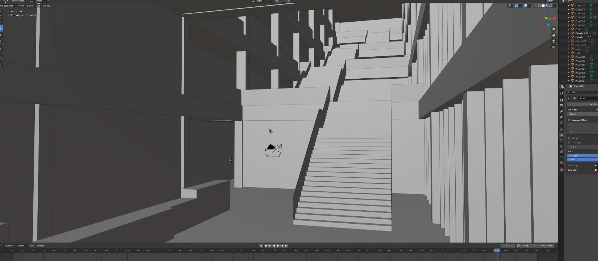

# R10 Blender

Voor de simulatie van het R10 gebouw ging een 3D model komen. Met de ontvangen blueprint bestand kon ik met behulp van voor- en zijaanzichten een grove representatie maken van de ingang van het R10 gebouw. Verder had ik nog nooit echt met Blender gewerkt maar door dit model te maken heb ik veel geleerd hoe je objecten kun aanmaken, verplaatsen, manipuleren, importeren en exporteren.

#### Screenshot 1

#### Screenshot 2

Dit bestand kon ik rechtstreeks importeren in Unity zodat de simulatie eindelijk zijn omgeving had.

