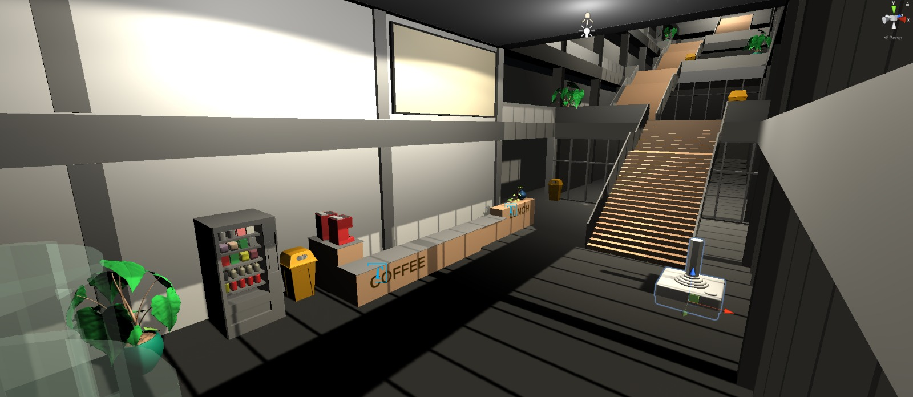
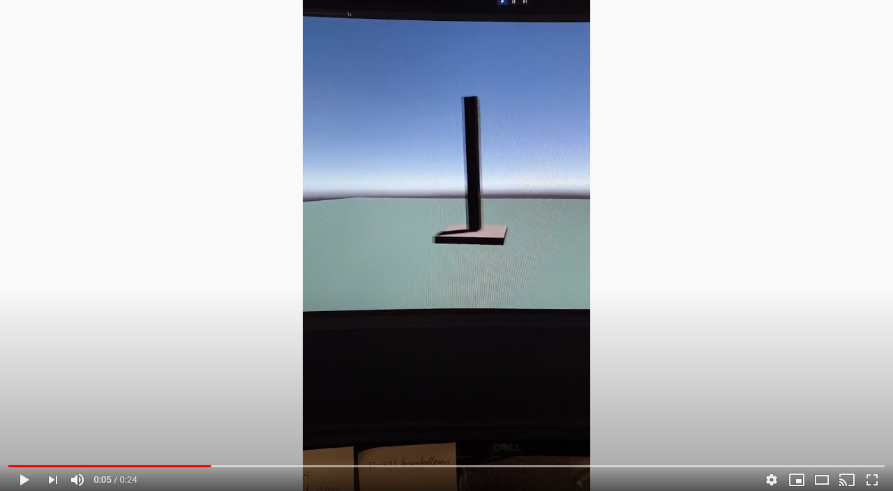
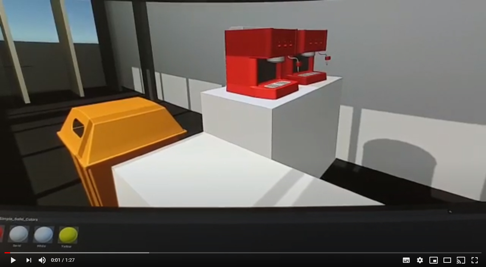

# R10 Unity 

Dit is het Unity project waarin in mijn gemaakte dingen in Blender uittest in Unity voordat ik het door stuur naar Victor zodat hij het kan verbinden met het projectie scherm. 

### Setup

1. Installeer Unity
2. Installeer Unity Hub
3. Clone deze repository
4. Open Unity Hub
5. Navigeer naar Unity Project/
6. Klik op open project

## R10 Unity - First Joystick [WIP] Video

## R10 Unity [WIP] Video

